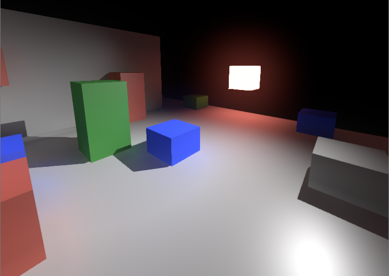

# Renthyl

[](https://jitpack.io/#codex128/Renthyl)



Renthyl is a modular, code-first, and completely customizable rendering pipeline for [JMonkeyEngine](https://jmonkeyengine.org/) suitable for any game. It is designed to be as fast as possible by culling unnecessary render operations and minimizing resource creation.

Renthyl is currently in alpha status: there may be bugs. If one is encountered, please open an issue with stacktraces, example code, and screenshots if applicable. Also note that many features within the RenthylPlus subproject are work-in-progress.

## Get Started

Using basic Renthyl framegraphs are easy. First add Renthyl to the Gradle build script.

```groovy
repositories {
    maven {
        url "https://jitpack.io"
    }
}
dependencies {
    implementation "com.github.codex128:RenthylJme:2.0.0-alpha"
    implementation "com.github.codex128:RenthylJme:2.0.0-alpha:sources"
    implementation "com.github.codex128:RenthylJme:2.0.0-alpha:javadoc"
}
```

Then create a FrameGraph and attach it to the main ViewPort.

```java
FrameGraph fg = Renthyl.forward(assetManager);
viewPort.setPipeline(fg);
```

### Renthyl Guide

1. [Understanding Renthyl](Wiki/UnderstandingRenthyl.md)
2. [Modules](Wiki/Modules.md)
3. [Resource Definitions](Wiki/ResourceDefinitions.md)
4. [Features](Wiki/Features.md)
5. [Porting Filters](Wiki/PortingFilters.md)
6. [Resource System](Wiki/ResourceSystem.md)
7. [Multithreading](Wiki/Multithreading.md)

## Contributing

Contributors are welcome and wanted! Please see the [contribution guidelines](Contribution.md) to get started. If you have the know-how, consider implementing a rendering technique in the RenthylPlus subproject.
