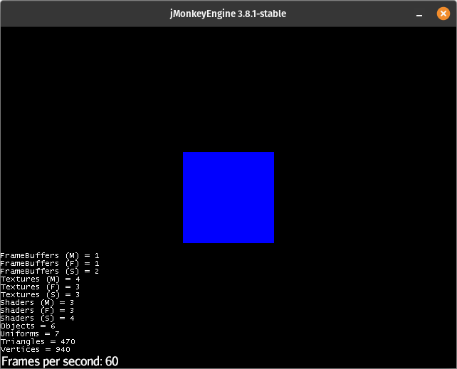
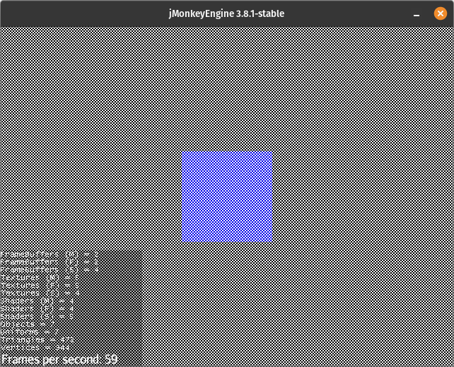

# Using Renthyl with JMonkeyEngine

Since Renthyl was originally designed as an advanced rendering pipeline for [JMonkeyEngine](https://jmonkeyengine.org/), the Renthyl project includes a subproject -- RenthylJme -- that contains rendering components for the engine. This tutorial will focus on using RenthylJme with JMonkeyEngine.

> Make sure to use at least JMonkeyEngine 3.8. Renthyl depends on the render pipeline feature introduced in that version.

## Basic Forward Renderer

First, add RenthylJme as a dependency.

```groovy
dependencies {
    ...
    implementation "com.github.codex128.Renthyl:RenthylJme:2.0.1-alpha"
}
```

Make sure the main viewport contains something to render. We will use an unshaded cube.

```java
Geometry geometry = new Geometry("cube", new Box(1, 1, 1));
Material mat = new Material(assetManager, "Common/MatDefs/Misc/Unshaded.j3md");
mat.setColor("Color", ColorRGBA.Blue);
geometry.setMaterial(mat);
rootNode.attachChild(geometry);
```

For JME rendering, we will use an extension of FrameGraph called JmeFrameGraph instead of FrameGraph directly in order to interface with the rendering system.

```java
JmeFrameGraph fg = new JmeFrameGraph(assetManager);
```

To render the main viewport with the framegraph, register the framegraph as the viewport's pipeline.

```java
viewPort.setPipeline(fg);
```

Now JME uses the JmeFrameGraph to render geometries attached to the rootNode. However, if you try running it now, nothing will get rendered because we haven't added the framegraph tasks that actually perform the rendering. For this tutorial, we will mimick JME's forward renderer, which is fairly trivial to do.

Before we jump into adding tasks, though, we need to set up an resource allocator which will handle the allocation and lifecycle of things like textures. JME applications are recommended to use ResourceAllocationState (an extension of ShortTermAllocator).

```java
ResourceAllocationState allocator = new ResourceAllocationState();
stateManager.attach(allocator);
```

Now back to adding tasks. The first task used for virtually all JME projects is ControlRenderPass, which calls `controlRender` on all controls within the viewport's scenes. It accepts no input and produces no output.

```java
fg.add(new ControlRenderPass());
```

We will use SceneEnqueuePass to extract all the geometries in the viewport's scenes into GeometryQueues, which are optimized for rendering. Normally, JME puts each geometry into one of 5 queues (opaque, sky, transparent, gui, and translucent). We will do the same in order to be consistent with JME, and SceneEnqueuePass has a handy factory method for doing just that.

```java
SceneEnqueuePass enqueue = SceneEnqueuePass.withLegacyQueues();
```

It is beyond the scope of this tutorial to fully explain how SceneEnqueuePass works, but `withLegacyQueues` creates a new SceneEnqueuePass containing 5 queues, each matching a JME equivalent in name and behavior. If you want to be explicit, this is how `withLegacyQueues` sets up those queues:

```java
SceneEnqueuePass p = new SceneEnqueuePass();
p.addQueue(RenderQueue.Bucket.Opaque.name(), new BasicGeometryQueue(new OpaqueComparator()));
p.addQueue(RenderQueue.Bucket.Transparent.name(), new BasicGeometryQueue(new TransparentComparator()));
p.addQueue(RenderQueue.Bucket.Translucent.name(), new BasicGeometryQueue(new TransparentComparator()));
p.addQueue(RenderQueue.Bucket.Sky.name(), new BasicGeometryQueue(new NullComparator()) {
    @Override
    public void applySettings(FrameGraphContext context) {
        context.getDepthRange().pushValue(DepthRange.REAR);
    }
    @Override
    public void restoreSettings(FrameGraphContext context) {
        context.getDepthRange().pop();
    }
});
p.addQueue(RenderQueue.Bucket.Gui.name(), new BasicGeometryQueue(new GuiComparator()) {
    @Override
    public void applySettings(FrameGraphContext context) {
        context.getDepthRange().pushValue(DepthRange.FRONT);
        context.getCamera().pushValue(true);
    }
    @Override
    public void restoreSettings(FrameGraphContext context) {
        context.getDepthRange().pop();
        context.getCamera().pop();
    }
});
```

JME normally chooses the queue to put a geometry in based on the Bucket enumeration returned by `Spatial#getQueueBucket()`. SceneEnqueuePass instead uses a string stored in userdata under "GeometryRenderQueue", and uses `Spatial#getQueueBucket()` only if that userdata does not exist. This is to support the use of queues not named the same as one of JME's five queues.

The next step is to add a GeometryPass, which will render a set of GeometryQueues to a FrameBuffer.

```java
GeometryPass render = new GeometryPass(allocator);
```

Note that the GeometryPass requires a resource allocator. This is because the GeometryPass needs to allocate a color texture, a depth texture, and a framebuffer.

In order to present the render to the screen, add an OutputPass. It takes a color texture and a depth texture and renders them to the viewport's output FrameBuffer. OutputPass doesn't need a resource allocator because it is rendering to textures that already exist.

```java
OutputPass out = fg.addTask(new OutputPass());
```

`out` is explicitly added to the framegraph, of course, because we always want to to run. We only want `enqueue` and `render` to run if they contribute at all to the final output, so they are not explicitly added to the framegraph.

Finally, connect all the tasks together to complete the renderer.

```java
render.getGeometry().addMapSource(enqueue.getQueues());
out.getColor().setUpstream(render.getOutColor());
out.getDepth().setUpstream(render.getOutDepth());
```

If you did everything correctly, you should see the main viewport get rendered as usual.



Note the use of `addMapSource`. The geometry socket for GeometryPass is called a CollectorSocket and is able to take in inputs from a variety of different sources, including maps. The outgoing queue socket on SceneEnqueuePass is a map, which makes sense because geometries are added to queues by name. This presents a problem though. We want queues to be rendered in this order [opaque, sky, transparent, gui, translucent], but the map will return the queues in an arbitrary order.

To fix this, we'll add a MapToList task, which will transfer map elements to a list depending on a key order that we provide.

```java
MapToList<String, GeometryQueue> orderQueues = new MapToList<>(new String[] {
        RenderQueue.Bucket.Opaque.name(),
        RenderQueue.Bucket.Sky.name(),
        RenderQueue.Bucket.Transparent.name(),
        RenderQueue.Bucket.Gui.name(),
        RenderQueue.Bucket.Translucent.name()});
```

Change the socket connections to route through `orderQueues`.

```java
//render.getGeometry().addMapSource(enqueue.getQueues());
orderQueues.getMap().setUpstream(enqueue.getQueues());
render.getGeometry().addCollectionSource(orderQueues.getList());
```

This will have no impact visually, but this is an important step for more complex renders.

Now the forward renderer is done! Here is the application code so far.

```java
public class SimpleForwardTest extends SimpleApplication {

    public static void main(String[] args) {
        SimpleForwardTest app = new SimpleForwardTest();
        app.start();
    }

    @Override
    public void simpleInitApp() {

        Geometry geometry = new Geometry("cube", new Box(1, 1, 1));
        Material mat = new Material(assetManager, "Common/MatDefs/Misc/Unshaded.j3md");
        mat.setColor("Color", ColorRGBA.Blue);
        geometry.setMaterial(mat);
        rootNode.attachChild(geometry);

        JmeFrameGraph fg = new JmeFrameGraph(assetManager);
        viewPort.setPipeline(fg);

        ResourceAllocationState allocator = new ResourceAllocationState();
        stateManager.attach(allocator);

        fg.add(new ControlRenderPass());
        SceneEnqueuePass enqueue = SceneEnqueuePass.withLegacyQueues();
        MapToList<String, GeometryQueue> orderQueues = new MapToList<>(new String[] {
                RenderQueue.Bucket.Opaque.name(),
                RenderQueue.Bucket.Sky.name(),
                RenderQueue.Bucket.Transparent.name(),
                RenderQueue.Bucket.Gui.name(),
                RenderQueue.Bucket.Translucent.name()});
        GeometryPass render = new GeometryPass(allocator);
        OutputPass out = fg.addTask(new OutputPass());

        orderQueues.getMap().setUpstream(enqueue.getQueues());
        render.getGeometry().addCollectionSource(orderQueues.getList());
        out.getColor().setUpstream(render.getOutColor());
        out.getDepth().setUpstream(render.getOutDepth());

    }

}
```

## RasterTask

So far, any custom tasks we've implemented have extended AbstractTask. However, most JME-related tasks will use RasterTask instead. RasterTask exposes the FrameGraphContext being used by the JmeFrameGraph for rendering, and it provides access to the RenderManager, AssetManager, and other useful objects.

### Render Settings

In addition to exposing certain objects, FrameGraphContext also manages various render settings, such as forced material, forced technique, and the current framebuffer in order to keep these settings from leaking between tasks. It is highly recommended that such settings be set through the FrameGraphContext instead of the RenderManager or elsewhere.

For example, if a RasterTask implementation needs to set the forced technique during render, it would first set the value through the appropriate RenderSetting in the FrameGraphContext.

```java
context.getForcedTechnique().pushValue("Technique_To_Force");
```

After the forced technique is no longer needed, the previous value is "popped" back in.

```java
context.getForcedTechnique().pop();
```

## Post Processing

RenthylJme comes with ports for almost all of JME's post-processing filters. We can easily extend our forward render to add as many filters as we want.

First add a FilterChain, which is similar in function to a FilterPostProcessor.

```java
FilterChain filters = new FilterChain();
```

Add a filter to the chain. We chose CrossHatchPass because its effect is extremely obvious.

```java
filters.add(new CrossHatchPass(assetManager, allocator));
```

Change the socket connections to pipe the result from `render` through `filters` to `out`.

```java
//out.getColor().setUpstream(render.getOutColor());
filters.getSceneColor().setUpstream(render.getOutColor());
filters.getSceneDepth().setUpstream(render.getOutDepth());
out.getColor().setUpstream(filters.getFilterResult());
```

It should now look like the following.



### Custom Filters

Any task implementing PostProcessFilter can be added to a FilterChain (even FilterChain itself). RenthylJme provides an abstract implementation that will do most of the boilerplate stuff related to making filters, and hopefully you will find it easier to use than JME's Filter class.

```java
public class MyCustomFilter extends AbstractFilterTask {
    
    public MyCustomFilter(AssetManager assetManager, ResourceAllocator allocator) {
        super(allocator, new Material(assetManager, "My/Custom/Filter.j3md"), false);
    }

    @Override
    protected void configureMaterial(Material material) {
        // todo: implement
    }
    
}
```

The AbstractFilterTask constructor requires a resource allocator, material, and a boolean indicating whether or not the scene's depth texture is used by the filter. If false, it can sometimes be more efficient, but the depth texture is *not* passed to the filter shaders.

For most filters, the only method that needs to be overriden is `configureMaterial`, which called on every render, and is expected to (of course) update the filter material with the current parameters. We'll add a couple parameters as an example.

```java
private final ArgumentSocket<ColorRGBA> color = new ArgumentSocket<>(ColorRGBA.Blue);
private final ArgumentSocket<Float> factor = new ArgumentSocket<>(1f);
```

Remember to register the sockets.

```java
public MyCustomFilter(AssetManager assetManager, ResourceAllocator allocator) {
    ...
    addSockets(color, factor);
}
```

Then apply their values during `configureMaterial` to the material.

```java
@Override
protected void configureMaterial(Material material) {
    material.setColor("Color", color.acquire());
    material.setFloat("Factor", factor.acquire());
}
```

### Multi-pass Filters

Multi-pass filters are constructed using "child" tasks. There is nothing special about child tasks; their only distinction is that they happen to be managed by a parent task. An excellent example of a multi-pass filter is a two-pass gaussian blur filter.

```java
public class MyBlurFilter extends Frame implements PostProcessFilter {

    @Override
    public PointerSocket<Texture2D> getSceneColor() {}

    @Override
    public PointerSocket<Texture2D> getSceneDepth() {}

    @Override
    public Socket<Texture2D> getFilterResult() {}
    
}
```

The first obvious difference from the single-pass filter is that MyBlurFilter does not extend AbstractFilterTask. Instead it extends Frame and implements PostProcessFilter. This is because MyBlurFilter doesn't actually perform any filtering itself; it instead delegates to the child tasks, which we will create shortly.

Frame is a special Renderable implementation in that it avoids nasty errors that occur in "child-parent" relationships (i.e. task 1 depends on task 2, and task 2 depends on task 1). Suffice it to say that Frames cannot perform any rendering, but can wrap delegate (or "child") tasks in ways regular Renderables cannot. However, we don't technically need to extend Frame for this particular implementation, but it is good practice to in this situation anyway.

Here is the gaussian-blur pass as an inner-class in MyBlurFilter. It is set up exactly like a single-pass filter would be (in fact, it *is* a single-pass filter). I'll save you having to suffer through an explanation of gaussian blur implementation, but just note the `vertical` boolean controlling whether the blur is vertical or horizontal.

```java
private static class GaussianBlurPass extends AbstractFilterTask {

    private final boolean vertical;
    private final ArgumentSocket<Float> scale = new ArgumentSocket<>(this);
    private final ArgumentSocket<Float> downSamplingFactor = new ArgumentSocket<>(this);

    public GaussianBlurPass(AssetManager assetManager, ResourceAllocator allocator, boolean vertical) {
        super(allocator, new Material(assetManager, "Common/MatDefs/Blur/" + (vertical ? 'V' : 'H') + "GaussianBlur.j3md"), false);
        this.vertical = vertical;
        addSockets(scale, downSamplingFactor);
    }

    @Override
    protected void configureMaterial(Material material) {
        MaterialUtils.acquireToMaterial(material, "Scale", scale);
        material.setFloat("Size", Math.max(1f, (getDemension() / downSamplingFactor.acquire())));
    }

    private int getDemension() {
        Image colorImg = getSceneColor().acquireOrThrow("Scene color required.").getImage();
        return vertical ? colorImg.getHeight() : colorImg.getWidth();
    }

}
```

Now here is where the magic occurs. In the constructor of MyBlurPass, we create two GaussianBlurPasses for vertical and horizontal blur.

```java
private final GaussianBlurPass vertical, horizontal;

public MyBlurFilter(AssetManager assetManager, ResourceAllocator allocator) {
    vertical = new GaussianBlurPass(assetManager, allocator, true);
    horizontal = new GaussianBlurPass(assetManager, allocator, false);
}
```

Now connect both the output from `vertical` into the input of `horizontal`.

```java
public MyBlurFilter(AssetManager assetManager, ResourceAllocator allocator) {
    ...
    horizontal.getSceneColor().setUpstream(vertical.getFilterResult());
}
```

Neither gaussian-blur passes need the scene depth, so we won't bother connecting the depth sockets. We do, however, need an OptionalSocket as a placeholder for depth texture coming into MyBlurFilter.

```java
private final OptionalSocket<Texture2D> sceneDepth = new OptionalSocket<>(this, false);

public MyBlurFilter(AssetManager assetManager, ResourceAllocator allocator) {
    ...
    addSocket(sceneDepth);
}
```

Now everything is connected internally. We just need to implement the methods from PostProcessFilter, which is really simple since the input scene color socket is just the vertical blur's input color socket, and the filter result socket is just the horizontal blur's result socket.

```java
@Override
public PointerSocket<Texture2D> getSceneColor() {
    return vertical.getSceneColor();
}

@Override
public PointerSocket<Texture2D> getSceneDepth() {
    return sceneDepth;
}

@Override
public Socket<Texture2D> getFilterResult() {
    return horizontal.getFilterResult();
}
```

## TextureDef 

TextureDef is a ResourceDef implementation that defines textures. It is able to work with any type of texture, but includes helper methods for Texture2D and Texture3D in particular.

```java
TextureDef<Texture2D> myTex2D = TextureDef.texture2D();
```

This is the same as:

```java
TextureDef<Texture2D> myTex2D = new Texture2D(Texture2D.class, (Image img) -> new Texture2D(image));
```

## Shadows

> Shadows are still work-in-progress and may be unstable, however, they are usable. They are also missing important features, such as sampling. RenthylJme tests contains an application demonstrating how to use shadows inside the main forward render.

## Global Illumination

> All global illumination methods in RenthylJme are *experimental only*. They are not expected to work at this point.
